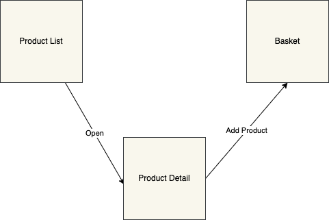
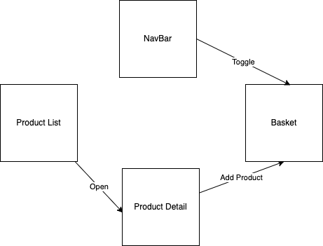

# Components

There are three main components in the application:

- Product List
- Product Detail
- Basket

These three components handle business logic and data.
Then there are the shell and the header.
The shell is the orchestrator of the components and the header is the navigation bar. It has more impact in the mobile version.

## Product List

This component is the owner of the product list.
It is responsible for fetching the products from the API and displaying them.
It has to handle the request for retrieving the data and cache the result to improve the user's experience in case they change the view or refresh the page.
It's also responsible to open the product detail view.
 
 

## Product Detail

This component is the owner of the product detail.
It is responsible for fetching the product detail data from the API and displaying them.
It has to cache the data to prevent a bad user experience in case the user refreshes the page. It must handle the go-back action to return to the product list view.
It's also responsible to notify the basket component when the user adds a product.
The last thing in charge of it is to check if the product is already in the basket, and in this case, set the add button as disabled.
 
 

## Basket

This component is the owner of the basket.
It's responsible for displaying the items in the basket and the money the user has to pay.
It handles the add and remove actions. Must cache the data to prevent wasting time in case of refreshing the page.
 
 

## Header

This component has two main responsibilities in the mobile version:

1. Display the number of items in the basket.
2. Toggle the basket view

The first point makes in relation header with the basket. In this case, the basket must share data with the header component.
 
 

## Shell

The shell component is the orchestrator of the application.
It's responsible for creating routes and handling the navigation between the components.
For this scenario, the best route implementation is something like this:

1.  /products -> Product List
2.  /products:/id --> Product Detail

The second route is nested in the first one. This is because the product detail view is a modal in the desktop version. Doing this, we can visualize the product list in the background. In this case, the basket component is part of the Product List page.
The approach for the mobile version is a bit different. The route is the same, but the product list page must work differently and handle the views to show only the right one for the user. To achieve this, the product list page must check the route and show the product detail in case the route is equal to `/products/:id`, show the product list in case the route is equal to `/products` and show the basket in case the user toggle the basket view from the navbar.
 
 

## Event Bus

The Event Bus is not a visual component but it's important for sending events between components.
In this case, the application uses the Event bus to toggle the basket view in the mobile version.

## Component Relationships

### Desktop version

### Mobile

